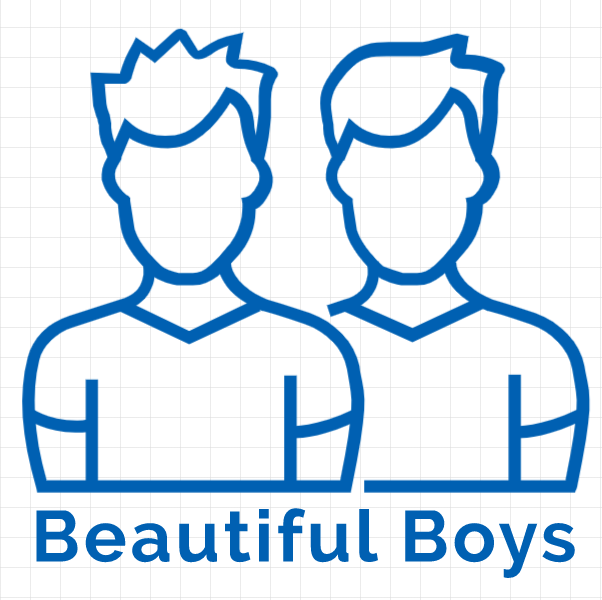

# Jose RM - Portfolio

<!--
HOW TO USE:
This is an example of how you may give instructions on setting up your project locally.

Modify this file to match your project and remove sections that don't apply.

REQUIRED SECTIONS:
- Table of Contents
- About the Project
  - Built With
  - Live Demo
- Getting Started
- Authors
- Future Features
- Contributing
- Show your support
- Acknowledgements
- License

OPTIONAL SECTIONS:
- FAQ

After you're finished please remove all the comments and instructions!
-->

  <!-- You are encouraged to replace this logo with your own! Otherwise you can also remove it. -->
  
   

<!-- TABLE OF CONTENTS -->

# 📗 Table of Contents

- [Jose RM - Portfolio](#jose-rm---portfolio)
- [📗 Table of Contents](#-table-of-contents)
- [📖 **Portfolio Jose RM. Full Stack Developer** (or so I try :D) ](#-portfolio-jose-rm-full-stack-developer-or-so-i-try-d-)
  - [🛠 Built With ](#-built-with-)
    - [Tech Stack ](#tech-stack-)
    - [Key Features ](#key-features-)
  - [🚀 Live Demo ](#-live-demo-)
  - [💻 Getting Started ](#-getting-started-)
    - [Prerequisites](#prerequisites)
    - [Setup](#setup)
    - [Usage](#usage)
    - [Deployment](#deployment)
  - [👥 Authors ](#-authors-)
  - [🔭 Future Features ](#-future-features-)
  - [🤝 Contributing ](#-contributing-)
  - [⭐️ Show your support ](#️-show-your-support-)
  - [🙏 Acknowledgments ](#-acknowledgments-)
  - [❓ FAQ ](#-faq-)
  - [📝 License ](#-license-)

# 📖 **Portfolio Jose RM. Full Stack Developer** (or so I try :D) 

**Portfolio Jose RM.** This is the Jose RM Portfolio, that allows you understand what are my skills as a developer.

## 🛠 Built With 

### Tech Stack 

### Key Features 

- HTML
- CSS
- Visual Studio Code 
- Figma

(<a href="#readme-top">back to top</a>)

<!-- LIVE DEMO -->

## 🚀 Live Demo 

- [Live Demo Link](#) https://joramot.github.io/capstone_portfolio/

(<a href="#readme-top">back to top</a>)

## 💻 Getting Started 

To get a local copy up and running, follow these steps.

### Prerequisites

In order to run this project you need:

Clone the repository using git, and open it with visual studio code.

### Setup

Clone this repository to your desired folder:

  cd "your-folder"
  git clone https://github.com/joramot/capstone_portfolio.git

  git clone [git@github.com:[https://github.com/joramot/capstone_portfolio.git]

### Usage

To open the project, use yout prefered explorer and open the index.html file 

### Deployment

You can deploy this project using visual studio code and Figma.

(<a href="#readme-top">back to top</a>)

## 👥 Authors 

👤 ** Jose RM **

- Project presentation: https://www.loom.com/share/76fd0013036545e98a6468ab7acfd356

- GitHub: https://github.com/joramot
- Twitter: https://twitter.com/el_rulis
- LinkedIn: https://linkedin.com/in/jose-RM

(<a href="#readme-top">back to top</a>)

## 🔭 Future Features 

- [ ] **Link to YouTube Channel**
- [ ] **News Section**
- [ ] **Blog**

(<a href="#readme-top">back to top</a>)

<!-- CONTRIBUTING -->

## 🤝 Contributing 

Contributions, issues, and feature requests are welcome!

(<a href="#readme-top">back to top</a>)

## ⭐️ Show your support 

If you like this project you can contact the author througt the above meddia links or by email to mojica.raul@gmail.com

(<a href="#readme-top">back to top</a>)

## 🙏 Acknowledgments 

I would like to thank Microverse and all the persons that got in touch with me while we were working on this project

I thank the code reviewers who took the time to give me their comments and observations to improve my project:

- [ ] **Felix Ouma @Felix45 GitHub: https://github.com/Felix45**
- [ ] **Akinlade Temitope @mckent05 GitHub: https://github.com/mckent05**
- [ ] **AVLESSI Matchoudi @LionRouge1 GitHub: https://github.com/LionRouge1**

(<a href="#readme-top">back to top</a>)

## ❓ FAQ 

- Is it difficult?

  - If you have knowledge about github basic commands, installing npm extension in visual studio code, figma, HTML and CSS it is easier, in other way, it can be little complicated

(<a href="#readme-top">back to top</a>)

## 📝 License 

This project is [MIT](./LICENSE) licensed.

(<a href="#readme-top">back to top</a>)

